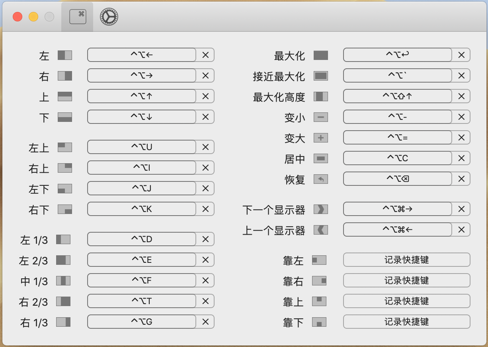

# Rectangle



## Install

```sh
brew cask install rectangle
```

## Config

Set or change shortcuts as you wish

## Shortcuts

`Meta`: `Ctrl+Option`

### Half

`4 arrows`

* Left: `Meta+left`
* Right: `Meta+right`
* Top: `Meta+top`
* Bottom: `Meta+bottom`

### Quarter

```text
UI
JK
```

* Top Left: `Meta+U`
* Top Right: `Mata+I`
* Bottom Left: `Meta+J`
* Bottom Right: `Meta+K`

### Third

```text
E T # 2/3 for left and right
DFG # 1/3 for left, middle and right
```

* Left 1/3: `Meta+D`
* Left 2/3: `Meta+E`
* Middle 1/3: `Meta+F`
* Right 2/3: `Meta+T`
* Right 1/3: `Meta+G`

### Display

* Next: `Meta+Shift+right`
* Previous: `Meta+Shift+left`

### Misc

* Max: `Meta+Enter`
* Near Max: `Meta+~`
* Center: `Meta+C`
