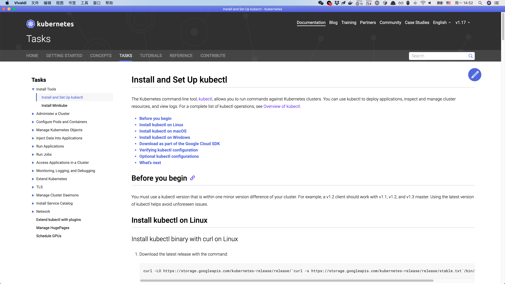

# Vivaldi

Version: 2.12.1862.3 (正式版本) （64 位）



## Install

```sh
brew cask install vivaldi
```

## Config

打开 `偏好设置`

### 通用

#### 启动

##### 默认浏览器

看**心情**要不要设置

* [ ] 在启动时检查

##### 主页

* [指定页面](https://vivaldi.com/)

##### 启动

* 上一次浏览会话
* [x] 延迟加载恢复的标签
    * [x] 总是加载锁定标签

#### 退出

##### 退出时确认

* [ ] 退出时显示确认对话框

#### 语言

##### 用户界面语言

简体中文

### 外观

#### 窗口外观

* [ ] 在标签中打开设置
* [ ] 在新标签中打开弹出窗口
* [x] 开启动画效果
* [x] 按钮式缩放控件
* [ ] 使用原生窗口

##### 状态栏

* 隐藏状态栏

##### 用户界面缩放

100%

#### 窗口背景图片

##### 窗口背景图片

* [ ] 显示窗口背景图片

##### 背景图片选项

* [x] 混合窗口增强色与背景图片

#### 颜色

##### 调整对比度

* 无修改

##### 后台窗口行为

* [x] 弱化前景色

##### 限制背景色饱和度

100%

### 主题

#### 主题

* Vivaldi

#### 主题日程

* 使用操作系统主题
    * 亮色主题：Vivaldi
    * 暗色主题：Dark

### 开始页面

#### 开始页面

##### 背景色

* Dark

##### 背景图片

* [x] 显示背景图片
* Aurora Dark

##### 背景图片选项

* [x] 适配窗口
* [ ] 重复

##### 起始页导航

* [ ] 总是显示导航

#### 快速拨号

##### 快速拨号外观

* 总是显示标题
* [x] 显示删除按钮
* [x] 显示缩略图控制按钮
* [x] 显示“添加”按钮

##### 最大列数

* 无限

##### 快拨缩略图尺寸

* 缩放适配列宽
* [x] 允许拖放排序

### 标签

#### 标签

* [ ] 显示标签栏

##### 标签栏位置

* 右侧（之后手动调整宽度到最窄）

##### 新标签页

* 开始页面

##### 新建标签位置

* 在**相关标签**之后

##### 克隆标签位置

* 紧邻原标签

##### 关闭标签激活

* [x] 总是激活相关标签
* 根据最近使用顺序激活标签

##### 标签处理

* [x] 对齐下一个关闭按钮
* [ ] 双击关闭标签
* [x] 关闭最后标签时不关闭窗口
* [ ] 聚焦于新标签的页面内容

#### 标签显示

##### 标签选项

* [x] 显示弹出缩略图
* [ ] 使用标签缩略图
* [ ] 显示关闭按钮
* [x] 检测页面标题中的通知
* [x] 显示未读角标
* [x] 休眠时变暗图标

##### 活动标签最小宽度

* 30 像素

##### 页面加载进度

* 进度条

#### 标签特性

##### 标签循环

* 按**最近使用**顺序循环
* [x] 显示标签循环
    * [x] 列表显示标签循环
* [x] 滚动切换标签
* [ ] 最小化活动标签（点击当前标签将切换到**最近的活动**标签）

##### 标签选定

* [x] 启用标签选定
* [x] 选定标签包含活动标签

##### 标签组

* [x] 启用标签组
* [x] 在当前标签组中打开标签
* [x] 允许标签组更名
* [x] 允许拖放式组合标签
* 成组延时：左二

##### 锁定标签

* 不关闭锁定标签

##### 标签静音

* 当前标签优先（考虑后台播放的音乐）

### 面板

#### 面板

##### 面板位置

* 左侧

##### 面板选项

* [ ] 显示面板切换键
* [ ] 悬浮面板

##### Web 面板

* [x] 检测页面标题中的通知

##### 笔记面板

* [x] 自动打开面板
* [x] 新增笔记时提醒
* [x] 获取新笔记的截图

##### 窗口面板

* [ ] 单击激活
* [x] 锁定的文件夹
* [x] 鼠标拖放创建标签组
* [x] 显示未读标签标记

### 地址栏

#### 地址栏

* [ ] 显示地址栏

##### 地址栏位置

* 顶部

##### 地址栏选项

* [x] 显示完整地址
* [x] 激活时选中地址
* [x] 复制剪切已转码地址
* [x] 页面加载进度条

##### 在新标签中打开地址

* Option + Enter

##### 地址自动完成

* [x] 已启用
    * [x] 优先显示书签

##### 地址框下拉菜单

* [x] 输入时显示下拉菜单
    * [x] 包括书签
    * [x] 包括输入历史
    * [x] 包括常用网页

##### 域名补全

* [ ] 已开启（Ctrl + Enter 补全顶级域名，优先级高于标签打开）

##### 配置文件管理

* [x] 显示配置文件按钮

##### 扩展可视

* 仅切换已隐藏的扩展
* [x] 下拉菜单中显示隐藏的扩展

### 书签

#### 书签

* [x] 在新标签中打开书签
* [ ] 单击打开书签面板中的书签
* [x] 打开大于此数量的书签需确认：20

#### 书签栏

* [ ] 显示书签栏

##### 选择为书签栏文件夹

* 书签

##### 书签栏位置

* 顶部

##### 书签栏显示

* 文字和图标

### 快捷命令

#### 快捷命令

* [x] 在新标签中打开页面
* [x] 限制显示的数量
* [x] 包含英文搜索词
* [ ] 保留上次输入记录

##### 在搜索结果中包含网页地址

* [x] 书签
* [x] 笔记
* [x] 页面操作
* [x] 历史记录条目
* [x] 计算器

### 键盘

#### 键盘

##### 焦点循环

* 遍历全局（Tab 键焦点遍历整个应用程序）

##### 完全键盘操作

* [ ] 跟随系统设置
* 聚焦输入区域（按 Tab 键仅聚焦文本框和列表）

##### 访问键

* [x] 启用访问快捷键（Ctrl + Option）

##### 键盘快捷键

* [x] 启用键盘快捷键
    * [ ] 单键快捷键
* [x] 按空格键快进

###### 窗口

|         目的 | 操作            |
| -----------: | :-------------- |
|     新建窗口 | Cmd + N         |
| 新建隐私窗口 | Cmd + Shift + N |
|     关闭窗口 | Cmd + Shift + W |
|     快捷命令 | Cmd + E         |
|   任务管理器 |                 |
|         设置 | Cmd + ,         |
|         扩展 | Cmd + Ctrl + E  |
|     历史记录 | Cmd + Y         |
|         书签 | Cmd + Ctrl + B  |

TODO: 按需添加

###### 视图

###### 标签

###### 页面

### 鼠标

#### 鼠标

##### 手势

* [x] 启用手势（按住鼠标右键画出手势）
* [x] 按住 Alt 键执行手势（在触摸板等输入设备使用鼠标手势）

##### 手势映射

默认手势

##### 手势敏感度

* 20 像素

##### 摇杆手势

* [x] 启用摇杆手势（按住鼠标右键再单击左键，可历史后退；按住鼠标左键再单击右键，可历史前进）

### 搜索

#### 搜索

##### 搜索框显示

* 禁用

##### 搜索选项

* [x] 在地址框中直接搜索
* [x] 在快速拨号中显示搜索框
* [ ] 记住最后选择的搜索引擎
* [ ] 后台搜索所选内容

##### 启用搜索建议

* [x] 在地址栏
    * [ ] 仅当使用搜索引擎简称时
* [ ] 在搜索栏

##### 搜索引擎

* StartPage（手动添加）
    * 名称：`StartPage`
    * 简称：`s`
    * URL: `https://www.startpage.com/rvd/search?query=%s&language=auto`
    * 建议 URL: `https://www.startpage.com/cgi-bin/csuggest?query=%s&limit=10&lang=english&format=json`

### 隐私

* 保存浏览记录：仅此会话
* Blocking Level: Block Trackers and Ads
* ✖️ 保存网页密码（使用 1Password 就好啦）

### 同步

登陆 Vivaldi 的账号密码，同步全部数据

### 实验性特性

打开 `vivaldi://experiments`

* ✅ Menu entries for installing Progressive Web Apps.

## Shortcut

见 `键盘快捷键`

## Problems

* 隐藏扩展后，扩展的快捷键不生效：通过右键使用扩展
